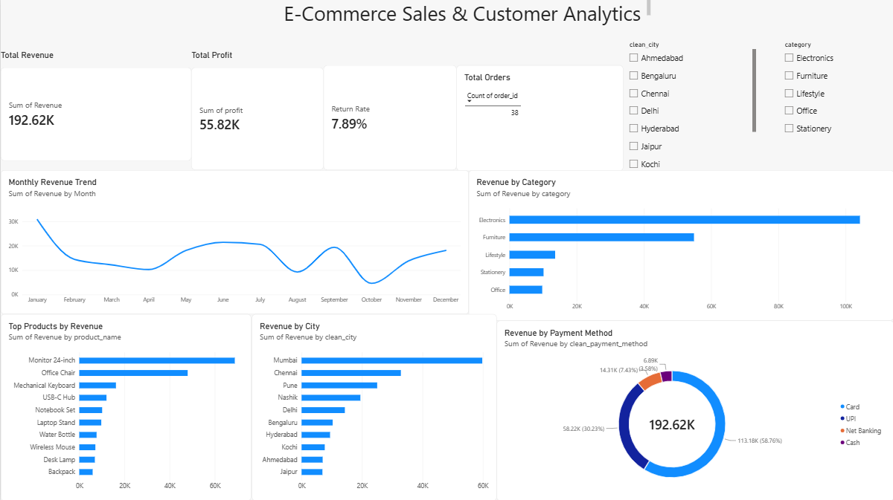
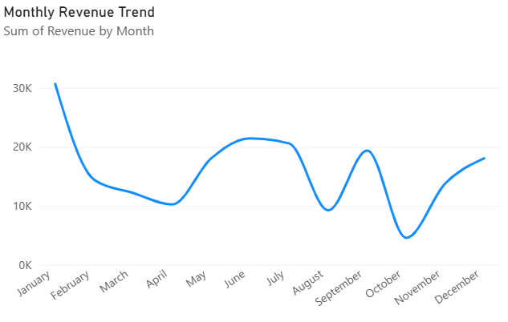
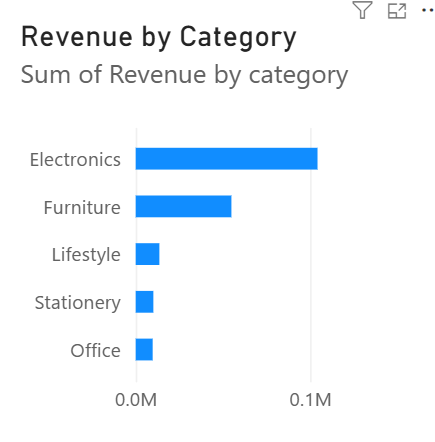
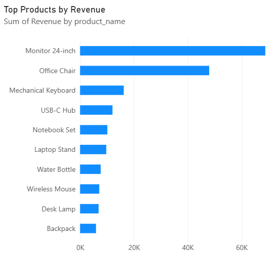
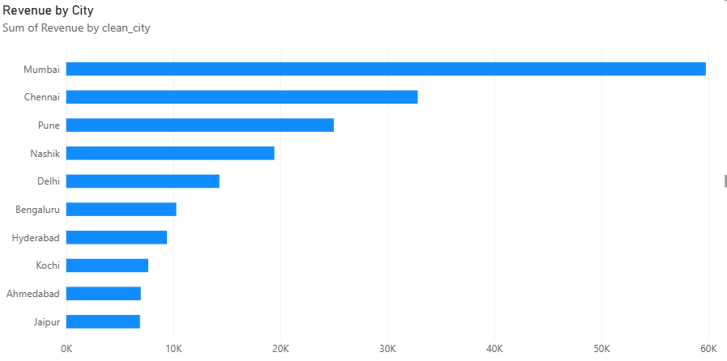
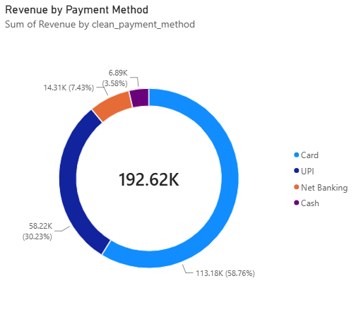

# E-Commerce Sales & Customer Analytics

An end-to-end data analytics project exploring e-commerce sales, profitability, product performance, customer locations, and returns using Excel, MySQL, Python, and Power BI.

## 📊 Project Dashboard



*Interactive Power BI dashboard with key performance indicators, sales trends, and business analysis.*

## 🎯 Business Objectives

- Measure revenue, profit, and order performance.
- Identify high-performing product categories and products.
- Analyze monthly sales trends.
- Compare revenue across cities and payment methods.
- Examine product returns and recommend improvements.

## 🛠️ Tools & Technologies

- **Microsoft Excel:** Data cleaning and preparation
- **MySQL:** SQL-based business analysis
- **Python:** Exploratory data analysis using Pandas and Matplotlib
- **Power BI:** Interactive dashboards and KPI reporting

## 📁 Dataset

The project contains four related datasets:

- **Customers:** Customer details and locations
- **Products:** Product categories, prices, and costs
- **Orders:** Transactions, quantities, revenue, profit, and payment methods
- **Returns:** Return dates and reasons

The illustrative dataset contains 38 orders from 2025.

## 📈 Key Performance Indicators

| Metric | Result |
|---|---:|
| Total Revenue | ₹192,615.75 |
| Total Profit | ₹55,815.75 |
| Total Orders | 38 |
| Return Rate | 7.89% |

## 🔍 Data Visualizations

### 1. Monthly Revenue Trend



January recorded the highest monthly revenue, while October recorded the lowest. These fluctuations can be investigated further using order volume, promotions, and inventory data.

### 2. Revenue by Category



Electronics was the leading category, generating ₹104,259.65 in revenue.

### 3. Top Products by Revenue



The Monitor 24-inch generated the highest product revenue at ₹68,842.35.

### 4. Revenue by City



Mumbai generated the highest city-level revenue in this dataset, followed by Chennai.

### 5. Revenue by Payment Method



Card payments contributed the largest share of recorded revenue, followed by UPI.

## 💡 Business Insights & Recommendations

1. **Category performance:** Review electronics inventory and product-level margins to support decisions about stock allocation.
2. **Product performance:** Monitor demand and stock availability for the Monitor 24-inch.
3. **Monthly trends:** Investigate the causes of monthly revenue fluctuations before changing promotional or inventory strategies.
4. **Regional performance:** Compare customer counts, order frequency, and marketing costs before expanding regional campaigns.
5. **Returns:** Review packaging, product descriptions, and fulfillment processes to investigate the recorded returns.

## 🧹 Data Preparation

- Checked for missing values and duplicate order IDs.
- Standardized city, payment method, and order status values.
- Converted date and numeric columns to appropriate data types.
- Calculated revenue, profit, and profit margin.
- Prepared the data for SQL analysis and Power BI reporting.

## 📂 Repository Structure

```text
Ecommerce-Sales-Customer-Analytics/
├── data/
│   ├── Customers.csv
│   ├── Products.csv
│   ├── Orders.csv
│   └── Returns.csv
├── images/
│   ├── dashboard.png
│   ├── monthly_revenue.png
│   ├── category_revenue.png
│   ├── top_products.png
│   ├── city_revenue.png
│   └── payment_methods.png
├── Ecommerce_Sales_Customer_Analytics.pbix
├── Business_Insights_and_Recommendations.docx
├── python_analysis.ipynb
└── README.md
```

## 🚀 How to Explore the Project

1. Review the CSV datasets in the `data/` folder.
2. Open `python_analysis.ipynb` in Google Colab or Jupyter Notebook.
3. Run the relevant SQL queries in MySQL Workbench after importing the datasets.
4. Open the `.pbix` file using Power BI Desktop to explore the interactive dashboard.

## ⚠️ Limitations

This project uses a small, illustrative dataset. The results demonstrate a data analytics workflow and should not be considered representative of a real e-commerce business.

## 👩‍💻 Author

**Darshana Mahajan**
